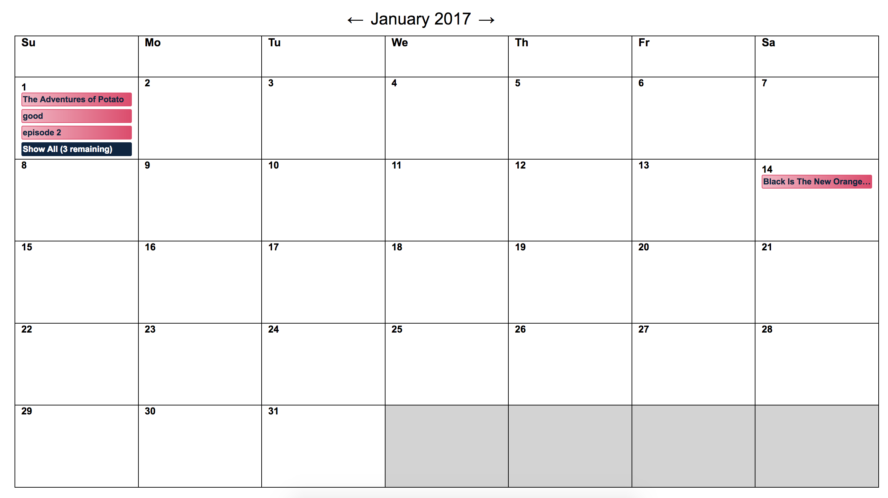
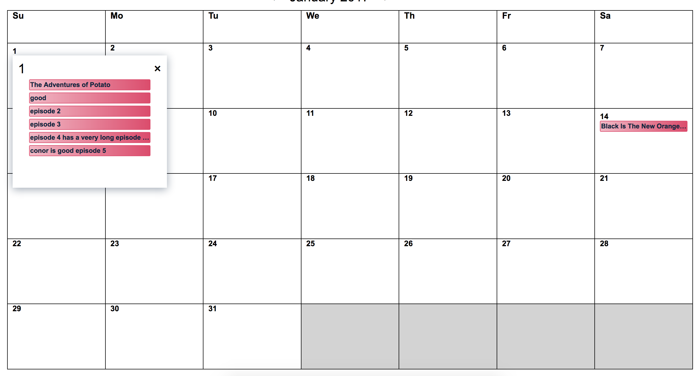

## Netflix Originals Calendar

<a href="https://netflix-gpxrkvbvbq.now.sh/calendar/2017/1">Access Demo Here</a>

### Basic calendar rendering

### Rendering with show more on date that could not fit all releases in square

### How to run

* switch to node 8 if not current node version
* npm install
* npm run build-dev
* npm start-dev || npm start
* navigate to http://localhost:3000

### Design Decisions

* Used local React state kept mostly at the top level of the application. This decision was made because each month is relatively static once the data is loaded
* Use local state futher down in the tree when appropriate (toggles, etc...)
* Use emotion for styling. I chose this because I find colocating styles with components to be the most intuitive component programming model developed so far. Emotion also means we don't have to give up things from css that traditional inline styling would cause.

### Trade Offs

* Using mostly top level state in React means sometimes passing state through intermediary components that don't need it. If the project was larger I would like turn at least partially to an alternative state management mechanism or add subscribe/action methods to the top level component. 
* Using emotion means run time penalties for style though we avoid network call. I would likely to look into extracting as many styles as possible pre deployment.
